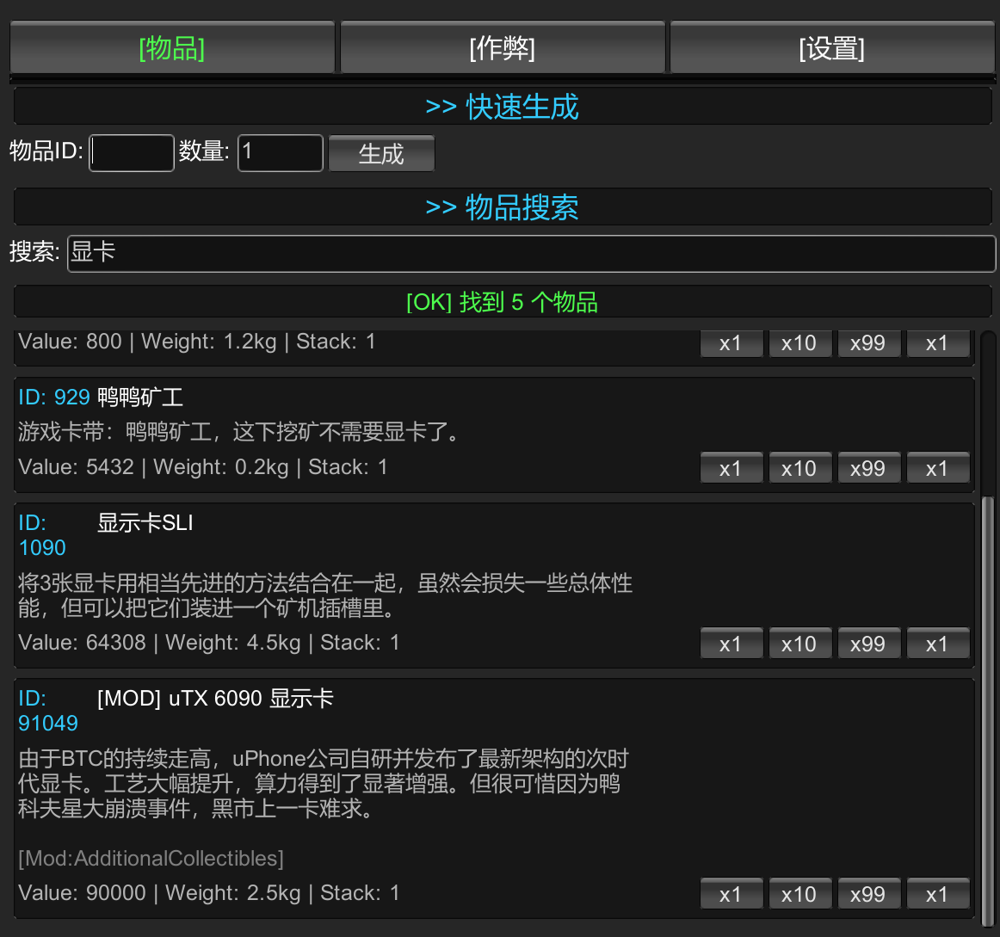

# Escape from Duckov In Game Cheat GUI Mod

项目代码和文档全部由AI生成，如有问题请问AI。

一个功能强大的《Escape from Duckov》游戏作弊菜单Mod，提供物品生成、玩家无敌、快速传送等功能。

## 📸 界面展示

*作弊菜单界面 - 物品生成器功能展示*

## ✨ 功能特性

### 🎁 物品生成器
- **智能搜索**：支持按物品ID或名称搜索
- **批量生成**：一键生成1/10/99/最大堆叠数量的物品
- **详细信息**：显示物品价值、重量、堆叠上限等属性

### 👤 玩家作弊
- **无敌模式**：切换角色无敌状态
- **快速传送**：按下鼠标中键传送到鼠标指向的位置

### ⚙️ 设置管理
- **缓存管理**：重新扫描、删除缓存、打开缓存文件夹
- **调试工具**：输出物品列表到日志

## 🎮 使用方法

### 打开/关闭菜单
- 按 **Home** 键打开或关闭作弊菜单

### 物品生成器使用

#### 方式一：快速生成（推荐）
1. 切换到「物品生成」标签页
2. 在搜索框输入物品名称或ID（如：`手枪` 或 `101`）
3. 点击「搜索」按钮
4. 在搜索结果中点击对应的按钮：
   - **x1**：生成1个
   - **x10**：生成10个
   - **x99**：生成99个
   - **x最大堆叠**：生成该物品的最大堆叠数量

#### 方式二：直接输入ID
1. 在「快速生成」区域输入物品ID
2. 输入生成数量
3. 点击「生成」按钮

### 玩家作弊功能

#### 无敌模式
1. 切换到「玩家作弊」标签页
2. 点击「切换无敌模式」按钮
3. 再次点击可关闭无敌模式

#### 快速传送
1. 切换到「玩家作弊」标签页
2. 点击「传送开关」按钮开启传送功能
3. 在游戏中，将鼠标指向想要传送到的位置
4. 按下 **鼠标中键（滚轮按下）** 即可传送
5. 再次点击「传送开关」可关闭传送功能

### 缓存管理

#### 首次使用
第一次使用时需要扫描游戏物品：
1. 切换到「物品生成」标签页
2. 点击「扫描游戏物品」按钮
3. 等待扫描完成（通常需要几秒钟）
4. 扫描完成后，物品列表会自动缓存

#### 更新缓存
如果游戏更新或添加了新物品：
1. 切换到「设置」标签页
2. 点击「重新扫描物品（更新缓存）」按钮
3. 等待扫描完成
